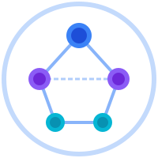
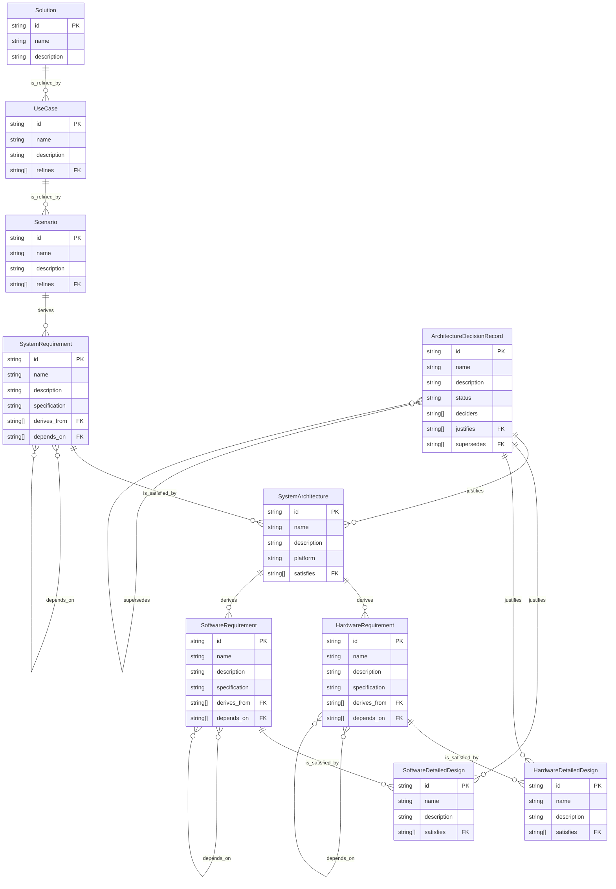

<p align="center">
  
</p>

<h1 align="center">SARA</h1>

<p align="center">
  <a href="https://github.com/cledouarec/sara/actions/workflows/ci.yml"></a>
  <a href="https://github.com/cledouarec/sara/actions/workflows/codeql.yml"></a>
  <a href="https://opensource.org/license/apache-2-0"></a>
</p>

**SARA** stands for **S**olution **A**rchitecture **R**equirement for **A**lignment.

SARA is a command-line tool that manages Architecture documents and Requirements as an interconnected knowledge graph, providing a **single source of truth** for all teams and contributors in your organization.

<p align="center">
  
</p>

## Table of Contents

<details>
<summary>Expand contents</summary>

- [Table of Contents](#table-of-contents)
- [Why SARA?](#why-sara)
  - [Alignment Across Teams](#alignment-across-teams)
  - [Markdown-First: A Radical Choice](#markdown-first-a-radical-choice)
- [Features](#features)
- [Installation](#installation)
  - [From crates.io (Recommended)](#from-cratesio-recommended)
  - [From Source](#from-source)
- [Quick Start](#quick-start)
- [Commands](#commands)
  - [Output Formats](#output-formats)
- [Configuration](#configuration)
  - [Environment Variables](#environment-variables)
- [Document Types](#document-types)
- [Traceability Hierarchy](#traceability-hierarchy)
- [Relationships: The Heart of SARA](#relationships-the-heart-of-sara)
  - [Relationship Types](#relationship-types)
  - [Defining Relationships in YAML](#defining-relationships-in-yaml)
  - [Peer Dependencies](#peer-dependencies)
  - [Architecture Decision Records](#architecture-decision-records)
  - [Bidirectional Traceability](#bidirectional-traceability)
  - [Relationship Fields by Item Type](#relationship-fields-by-item-type)
  - [Querying Relationships](#querying-relationships)
  - [Validation Rules](#validation-rules)
- [Custom Model Schema](#custom-model-schema)
  - [Declaring Item Types](#declaring-item-types)
  - [Field Types](#field-types)
  - [Declaring Relations](#declaring-relations)
  - [Custom Document Templates](#custom-document-templates)
- [Contributing](#contributing)
- [License](#license)

</details>

## Why SARA?

### Alignment Across Teams

In complex organizations, requirements and architecture documents are often scattered across teams, tools, and repositories. SARA brings everyone together by creating a unified knowledge graph that ensures:

- **Traceability**: Every requirement traces back to business needs and forward to implementation
- **Consistency**: All teams work from the same source of truth
- **Visibility**: Stakeholders can see the complete picture, from solution vision to detailed design

### Markdown-First: A Radical Choice

SARA deliberately uses **plain Markdown files** with YAML frontmatter instead of proprietary formats. This is a conscious decision:

- **No vendor lock-in**: Your requirements live in plain text files you own forever
- **Universal readability**: Anyone can read and edit documents without special software
- **Developer-friendly**: Markdown is the lingua franca of technical documentation
- **Git-native**: Full version control, branching, merging, and code review workflows
- **AI-ready**: Plain text formats are ideal for AI agents and LLMs - your requirements can be easily parsed, analyzed, and used as context for automated workflows and intelligent assistants
- **Future-proof**: Switch tools anytime - your data remains accessible
- **Zero dependencies**: No databases, no servers, no subscriptions
- **DRY principle**: Reuse your existing documentation - architecture diagrams, solution presentations, and product pages become part of your knowledge graph without duplication

Your requirements are too important to be trapped in a proprietary system. And your documentation should work harder - write once, trace everywhere.

## Features

- **Multi-Repository Support** - Aggregate documents from multiple Git repositories into a unified graph
- **Validation** - Detect broken references, orphaned items, circular dependencies, and duplicate identifiers
- **Traceability Queries** - Traverse upstream (toward Solution) or downstream (toward Detailed Designs)
- **Coverage Reports** - Generate traceability matrices and coverage reports in multiple formats
- **Version Comparison** - Compare knowledge graphs between Git commits or branches
- **Document Initialization** - Generate YAML frontmatter templates for new documents
- **Custom Model Schema** - Define your own document types, fields and relations in YAML, without recompiling

## Installation

### From crates.io (Recommended)

```bash
cargo install sara-cli
```

### From Source

```bash
# Clone the repository
git clone https://github.com/cledouarec/sara.git
cd sara

# Build and install
cargo install --path sara-cli

# Verify installation
sara --version
```

## Quick Start

<p align="center">
  
</p>

## Commands

| Command | Description |
|---------|-------------|
| `sara check` | Parse documents and validate graph integrity |
| `sara diff <REF1> <REF2>` | Compare graphs between Git references |
| `sara edit <ID>` | Edit existing document metadata by item ID |
| `sara init <FILE>` | Initialize metadata in a Markdown file |
| `sara query <ID>` | Query items and traceability chains |
| `sara report coverage` | Generate coverage report |
| `sara report matrix` | Generate traceability matrix |
| `sara schema` | Export the active model schema as YAML |

### Output Formats

Most commands support multiple output formats:

```bash
# Text output (default)
sara report coverage

# JSON output
sara report coverage --format json

# CSV output
sara report matrix --format csv -o matrix.csv
```

## Configuration

Sara uses a TOML configuration file (`sara.toml` by default):

```toml
# Optional: YAML file defining a custom domain model
model_schema = "model.yaml"

[repositories]
paths = [
    "./docs",
    "../other-repo/specs"
]

[validation]
strict_mode = false  # Enable strict validation (non-critical issues become errors)

[output]
colors = true
emojis = true

[templates]
paths = ["./templates"]  # Custom template directories (.tera document overrides)
```

### Environment Variables

| Variable | Description |
|----------|-------------|
| `SARA_CONFIG` | Path to configuration file |
| `NO_COLOR` | Disable colored output when set |

## Document Types

Out of the box, Sara recognizes 10 document types forming a requirements hierarchy. They are the built-in default of a fully data-driven model: you can extend or redefine them with a [custom model schema](#custom-model-schema).

| Type | YAML Value | Description |
|------|------------|-------------|
| Solution | `solution` | Customer-facing solution |
| Use Case | `use_case` | Customer/market need |
| Scenario | `scenario` | Abstract system behavior |
| System Requirement | `system_requirement` | Quantifiable system-level need |
| System Architecture | `system_architecture` | Platform implementation |
| Hardware Requirement | `hardware_requirement` | Hardware-specific need |
| Software Requirement | `software_requirement` | Software-specific need |
| HW Detailed Design | `hardware_detailed_design` | Hardware implementation |
| SW Detailed Design | `software_detailed_design` | Software implementation |
| Architecture Decision Record | `architecture_decision_record` | Cross-cutting design decision |

## Traceability Hierarchy


```mermaid
erDiagram
    Solution {
        string id PK
        string name
        string description
    }

    UseCase {
        string id PK
        string name
        string description
        string[] refines FK
    }

    Scenario {
        string id PK
        string name
        string description
        string[] refines FK
    }

    SystemRequirement {
        string id PK
        string name
        string description
        string specification
        string[] derives_from FK
        string[] depends_on FK
    }

    SystemArchitecture {
        string id PK
        string name
        string description
        string platform
        string[] satisfies FK
    }

    HardwareRequirement {
        string id PK
        string name
        string description
        string specification
        string[] derives_from FK
        string[] depends_on FK
    }

    SoftwareRequirement {
        string id PK
        string name
        string description
        string specification
        string[] derives_from FK
        string[] depends_on FK
    }

    HardwareDetailedDesign {
        string id PK
        string name
        string description
        string[] satisfies FK
    }

    SoftwareDetailedDesign {
        string id PK
        string name
        string description
        string[] satisfies FK
    }

    ArchitectureDecisionRecord {
        string id PK
        string name
        string description
        string status
        string[] deciders
        string[] justifies FK
        string[] supersedes FK
    }

    Solution ||--o{ UseCase : "is_refined_by"
    UseCase ||--o{ Scenario : "is_refined_by"
    Scenario ||--o{ SystemRequirement : "derives"
    SystemRequirement ||--o{ SystemArchitecture : "is_satisfied_by"
    SystemArchitecture ||--o{ HardwareRequirement : "derives"
    SystemArchitecture ||--o{ SoftwareRequirement : "derives"
    HardwareRequirement ||--o{ HardwareDetailedDesign : "is_satisfied_by"
    SoftwareRequirement ||--o{ SoftwareDetailedDesign : "is_satisfied_by"
    SystemRequirement }o--o{ SystemRequirement : "depends_on"
    HardwareRequirement }o--o{ HardwareRequirement : "depends_on"
    SoftwareRequirement }o--o{ SoftwareRequirement : "depends_on"
    ArchitectureDecisionRecord ||--o{ SystemArchitecture : "justifies"
    ArchitectureDecisionRecord ||--o{ SoftwareDetailedDesign : "justifies"
    ArchitectureDecisionRecord ||--o{ HardwareDetailedDesign : "justifies"
    ArchitectureDecisionRecord }o--o{ ArchitectureDecisionRecord : "supersedes"
```

## Relationships: The Heart of SARA

Relationships are what transform isolated documents into a connected knowledge graph. They establish traceability between items, enabling impact analysis, coverage tracking, and requirement validation.

### Relationship Types

SARA uses semantic relationship names that reflect the nature of the connection:

| Relationship | Direction | Usage |
|--------------|-----------|-------|
| `refines` / `is_refined_by` | Upstream / Downstream | Solution ↔ Use Case ↔ Scenario |
| `derives_from` / `derives` | Upstream / Downstream | Scenario ↔ System Requirement, System Architecture ↔ HW/SW Requirement |
| `satisfies` / `is_satisfied_by` | Upstream / Downstream | System Requirement ↔ System Architecture, HW/SW Requirement ↔ Detailed Design |
| `depends_on` / `is_required_by` | Peer (same type) | Requirement ↔ Requirement (same level dependencies) |
| `justifies` / `justified_by` | Upstream / Downstream | ADR ↔ System Architecture, Detailed Design |
| `supersedes` / `superseded_by` | Peer (same type) | ADR ↔ ADR |

### Defining Relationships in YAML

Relationships are defined in the YAML frontmatter using reference fields:

```yaml
---
id: "SYSREQ-001"
type: system_requirement
name: "Authentication Response Time"
# Upstream: where this requirement comes from
derives_from:
  - "SCEN-001"
  - "SCEN-002"
# Downstream: what implements this requirement
is_satisfied_by:
  - "SYSARCH-001"
# Peer: dependencies on other requirements of the same type
depends_on:
  - "SYSREQ-002"  # Must have session management before auth timing
---
```

### Peer Dependencies

Requirements can depend on other requirements of the same type using `depends_on` / `is_required_by`. This is useful for:

- **Prerequisite requirements**: SYSREQ-AUTH depends on SYSREQ-SESSION
- **Ordering constraints**: HWREQ-POWER must be satisfied before HWREQ-CPU
- **Shared foundations**: Multiple SW requirements depend on SWREQ-LOGGING

```yaml
---
id: "SWREQ-RETRY"
type: software_requirement
name: "Retry Logic with Exponential Backoff"
derives_from:
  - "SYSARCH-COMM"
depends_on:
  - "SWREQ-LOGGING"  # Retry events must be logged
  - "SWREQ-CONFIG"   # Retry params come from config
---
```

### Architecture Decision Records

ADRs capture significant design decisions and link them to the artifacts they justify. They have a lifecycle status and track decision-makers:

```yaml
---
id: "ADR-001"
type: architecture_decision_record
name: "Use JWT for Authentication"
status: accepted
deciders:
  - "Alice Smith"
  - "Bob Johnson"
# Design artifacts this decision justifies
justifies:
  - "SYSARCH-AUTH"
  - "SWDD-AUTH-SERVICE"
---

# Context

We need a stateless authentication mechanism for our microservices.

# Decision

Use JWT (JSON Web Tokens) for authentication between services.

# Consequences

- Stateless: no session storage needed
- Tokens can be validated without database lookup
- Must handle token expiration and refresh
```

When a decision is replaced, use `supersedes` to maintain the decision history:

```yaml
---
id: "ADR-002"
type: architecture_decision_record
name: "Switch to OAuth 2.0 with JWT"
status: accepted
deciders:
  - "Alice Smith"
supersedes:
  - "ADR-001"  # This ADR replaces the previous auth decision
justifies:
  - "SYSARCH-AUTH"
  - "SWDD-AUTH-SERVICE"
---
```

### Bidirectional Traceability

You only need to define the relationship in one direction - SARA automatically infers the reverse link:

```yaml
# In SCEN-001.md - defines downstream link
---
id: "SCEN-001"
derives:
  - "SYSREQ-001"
---

# OR in SYSREQ-001.md - defines upstream link (equivalent)
---
id: "SYSREQ-001"
derives_from:
  - "SCEN-001"
---
```

Both approaches create the same bidirectional relationship in the graph.

> [!TIP] Best Practice: Bottom-Up Linking
>
> While both directions are supported, we recommend using **upstream links** (bottom-up strategy). Lower-level items should reference the higher-level items they derive from or satisfy:
>
> - A Software Detailed Design knows which Software Requirements it `satisfies`
> - A System Requirement knows which Scenarios it `derives_from`
> - A Use Case knows which Solution it `refines`
>
> This approach reflects natural knowledge flow: implementation details know their purpose, but high-level solutions shouldn't need to know every design decision. A Solution document shouldn't list all Use Cases - that would require constant updates as the system evolves.
>
> Both directions remain supported for flexibility in particular cases, but upstream linking should be your default choice.

### Relationship Fields by Item Type

| Item Type | Upstream Field | Downstream Field | Peer Dependencies |
|-----------|----------------|------------------|-------------------|
| Solution | - | `is_refined_by` | - |
| Use Case | `refines` | `is_refined_by` | - |
| Scenario | `refines` | `derives` | - |
| System Requirement | `derives_from` | `is_satisfied_by` | `depends_on` / `is_required_by` |
| System Architecture | `satisfies` | `derives`, `justified_by` | - |
| HW/SW Requirement | `derives_from` | `is_satisfied_by` | `depends_on` / `is_required_by` |
| HW/SW Detailed Design | `satisfies` | `justified_by` | - |
| Architecture Decision Record | `justifies` | - | `supersedes` / `superseded_by` |

### Querying Relationships

Once relationships are defined, you can traverse the graph:

```bash
# Find everything that traces up to business needs
sara query SWDD-001 --upstream

# Output:
# SWDD-001: Auth Service Implementation
# └── SWREQ-001: JWT Token Generation
#     └── SYSARCH-001: Authentication Architecture
#         └── SYSREQ-001: Response Time Requirement
#             └── SCEN-001: User Login Scenario
#                 └── UC-001: User Authentication
#                     └── SOL-001: Customer Portal

# Find everything that implements a scenario
sara query SCEN-001 --downstream
```

### Validation Rules

SARA validates your relationships to ensure graph integrity:

- **Broken references**: Links to non-existent items
- **Circular dependencies**: A → B → C → A (cycles indicate modeling errors)
- **Orphan items**: Items with no upstream parent (configurable as warning or error)
- **Invalid relationships**: Wrong relationship type for item types (e.g., a Solution cannot `derive_from`)
- **Duplicate identifiers**: Same ID used in multiple files

```bash
# Parse and validate all relationships
sara check

# Strict mode: treat orphan items and other non-critical issues as errors
sara check --strict

# Output as JSON
sara check --format json

# Write output to file
sara check -o results.json --format json
```

## Custom Model Schema

The 10 built-in document types are only the default model. The whole domain model - item types, their typed fields, the relation catalog and the allowed links - can be defined in a YAML file loaded at runtime, with no recompilation.

A custom schema **replaces the built-in model entirely**: only the types and relations it declares exist, and every reference inside the file must resolve within the file. The natural workflow is therefore to start from the built-in model and edit it:

```bash
# Export the active model (the built-in one when none is configured)
sara schema -o model.yaml

# Always available, even when a custom schema is configured
sara schema --builtin
```

Then point your configuration at the schema file:

```toml
model_schema = "model.yaml"
```

### Declaring Item Types

Add your types to the exported model (or trim it down to your own):

```yaml
item_types:
- id: stakeholder_requirement
  display_name: Stakeholder Requirement
  prefix: STKREQ
  id_format: "{prefix}-{seq:03}"
  parent_types:
  - solution
  fields:
  - name: rationale
    display_name: Rationale
    field_type: text
    required: true
    placeholder: Explain why the stakeholder needs this.
  - name: review_date
    display_name: Review date
    field_type: date
  allowed_targets:
  - relation: refines
    targets:
    - solution
```

| Key | Required | Description |
|-----|----------|-------------|
| `id` | yes | Snake_case identifier, used as the `type:` value in frontmatter |
| `display_name` | yes | Human-readable label used in reports and help texts |
| `prefix` | yes | Identifier prefix (e.g. `STKREQ-001`); its lowercase form becomes the `sara init` alias |
| `id_format` | yes | Identifier format template (reserved; identifiers currently render as `PREFIX-NNN`) |
| `parent_types` | no | Types a parent must have; empty for hierarchy roots |
| `fields` | no | Typed frontmatter fields (see below) |
| `allowed_targets` | no | Relations this type may declare, with their valid target types |

> **Note:** `id_format` uses Sara's own placeholder syntax, not [Tera](https://keats.github.io/tera/docs/): `{prefix}` is the type's `prefix` and `{seq:03}` is the per-type sequence number zero-padded to three digits (so the first stakeholder requirement is `STKREQ-001`). The key is reserved for future use — today identifiers always render as `PREFIX-NNN` regardless of its value.

Each field declares `name`, `display_name`, a `field_type`, an optional `required` flag and an optional `placeholder` used when `sara init` runs without input for a required field.

A custom type behaves exactly like a built-in one across the whole pipeline:

```bash
# A generated subcommand with flags derived from the declared fields...
sara init stakeholder-requirement docs/STKREQ-001.md \
  --name "Operator overview" \
  --rationale "Operators need a single pane of glass."

# ...including the prefix alias, validation, queries and reports
sara init stkreq docs/STKREQ-002.md
sara query STKREQ-001 --upstream
sara query SOL-001 --type stakeholder_requirement --downstream
```

### Field Types

| `field_type` | Frontmatter value |
|--------------|-------------------|
| `text` | Free-form string |
| `!enum` with `values` | One value among a closed set (validated at parse time) |
| `item_ref` | Reference to another item's identifier |
| `!list <inner>` | Ordered list of an inner type (e.g. `!list text`, `!list item_ref`) |
| `date` | ISO-8601 date |

```yaml
fields:
- name: status
  display_name: Status
  field_type: !enum
    values:
    - draft
    - approved
  required: true
  placeholder: draft
- name: reviewers
  display_name: Reviewers
  field_type: !list text
```

### Declaring Relations

Relations come in pairs with symmetric inverses and a direction. The validity matrix is **derived** from the `allowed_targets` each type declares - there is no separate matrix to maintain.

```yaml
# Added to a schema that also declares system_requirement and its relations
item_types:
- id: test_case
  display_name: Test Case
  prefix: TC
  id_format: "{prefix}-{seq:03}"
  parent_types:
  - system_requirement
  fields: []
  allowed_targets:
  - relation: verifies
    targets:
    - system_requirement
relations:
- id: verifies
  display_name: Verifies
  inverse: is_verified_by
  direction: upstream
  primary: true
- id: is_verified_by
  display_name: Is verified by
  inverse: verifies
  direction: downstream
  primary: false
```

| Key | Description |
|-----|-------------|
| `id` | Snake_case identifier, used as the frontmatter field name |
| `display_name` | Human-readable label |
| `inverse` | Id of the inverse relation (`relation(inverse).inverse` must point back) |
| `direction` | `upstream` (toward the root), `downstream`, or `peer` (between items of the same type) |
| `primary` | `true` for the declared side of the pair; inverse edges are derived for traversal |

A document of the type above can then use the relation like any built-in one:

```yaml
---
id: "TC-001"
type: test_case
name: "Latency check"
verifies:
  - "SYSREQ-001"
---
```

Peer relations (like the built-in `depends_on` and `supersedes`) are optional links between items of the same type; cycles across them are reported by `sara check` like any other circular dependency.

### Custom Document Templates

`sara init` renders new documents with a built-in body per type, and a generic body listing the declared fields for types that have none. You can override the body of any type with a [Tera](https://keats.github.io/tera/) template named after the type id, discovered through the `[templates]` configuration:

```toml
[templates]
paths = ["./templates"]  # picks up ./templates/<type_id>.tera files
```

```jinja


# Stakeholder Requirement: {{ name }}

## Rationale

{{ rationale | default(value="[Why is this needed?]") }}
```

The `frontmatter.tera` partial renders the YAML header from the declared fields and relations; every declared field value is also available as a variable in the body.

## Contributing

Contributions are welcome! Please read our [Contributing Guide](CONTRIBUTING.md)
for details on how to submit pull requests, coding standards, and development
setup.

## License

This project is licensed under the Apache 2.0 License - see the [LICENSE](LICENSE)
file for details.
