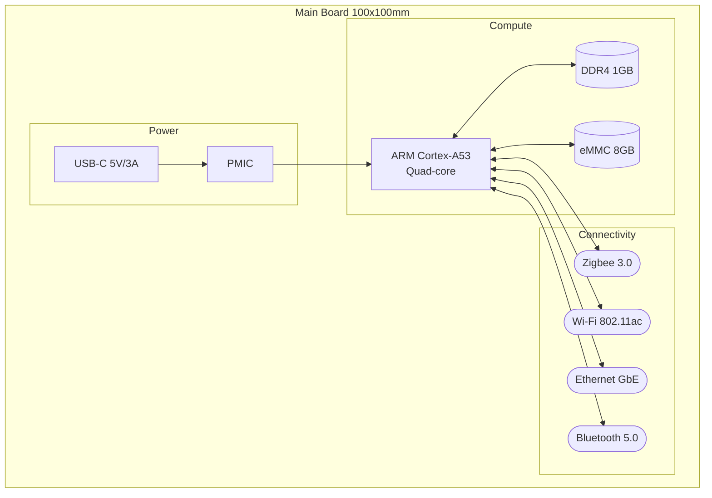
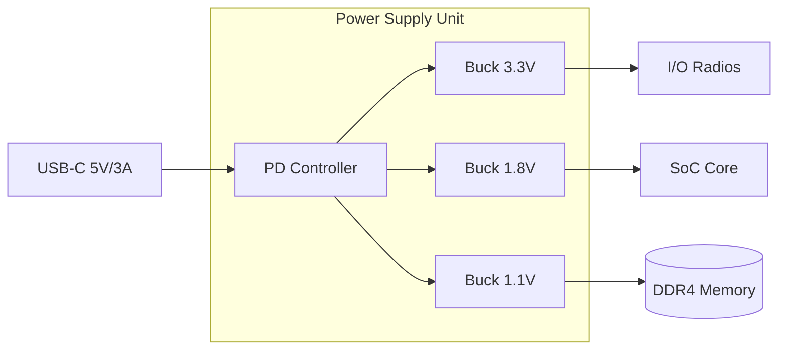
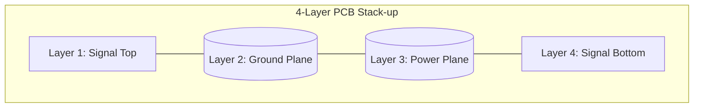

# Hub Main Board Design

## Board Specifications

- Form factor: 100mm x 100mm
- Layers: 4-layer PCB
- Stack-up: Signal-Ground-Power-Signal

## Block Diagram

## Power Distribution

- Input: 5V/3A USB-C with PD negotiation
- Rails: 5V, 3.3V, 1.8V, 1.1V (DDR4)
- Efficiency: > 85% at full load

## Layer Stack-up

