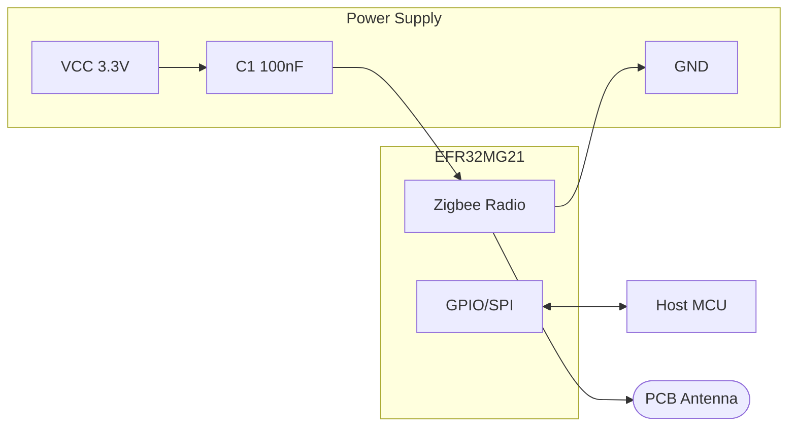
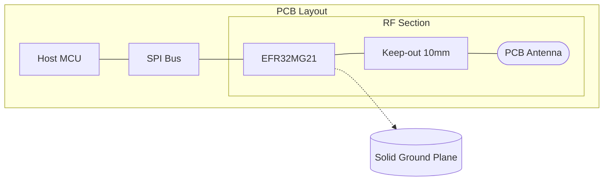

# Zigbee Module Integration

## Component Selection

Selected module: Silicon Labs EFR32MG21

## PCB Layout

- Module placement: Edge of PCB for optimal antenna performance
- Keep-out zone: 10mm around antenna area
- Ground plane: Solid ground under module except antenna feed

## Schematic

## RF Performance

- Conducted output power: +10 dBm
- Receiver sensitivity: -104 dBm
- Antenna gain: +2 dBi (PCB trace antenna)

## PCB Layout Zones

