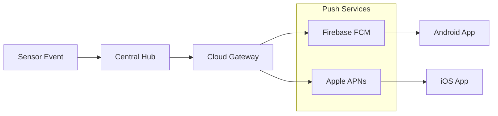
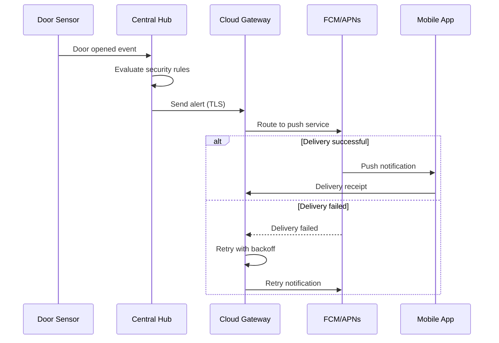

# Push Notification Service

## Overview

Security alerts are delivered to user mobile devices using Firebase Cloud
Messaging (FCM) for Android and Apple Push Notification Service (APNs) for iOS.

## Architecture



## Priority Levels

| Priority | Use Case              | FCM Priority | APNs Priority |
|----------|-----------------------|--------------|---------------|
| Critical | Intrusion, fire       | High         | 10            |
| High     | Door/window open      | High         | 5             |
| Normal   | Battery low           | Normal       | 1             |

## Payload Structure

```json
{
  "notification": {
    "title": "Security Alert",
    "body": "Front door opened"
  },
  "data": {
    "event_type": "door_sensor",
    "device_id": "sensor-front-door",
    "timestamp": "2024-01-15T10:30:00Z",
    "zone": "entry"
  }
}
```

## Retry Policy

- Maximum 3 delivery attempts
- Exponential backoff: 1s, 2s, 4s
- Fall back to SMS for critical alerts if push fails

## Alert Delivery Sequence


