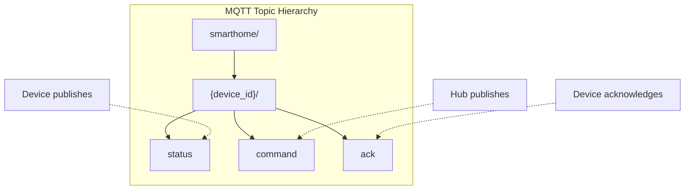
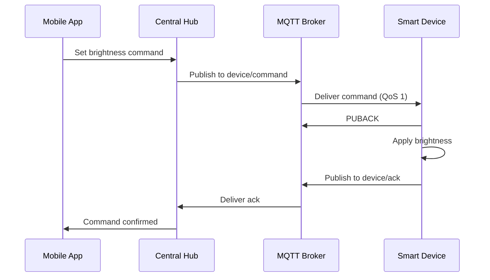

# MQTT Communication Protocol

## Overview

All smart devices communicate with the central hub using MQTT (Message Queuing
Telemetry Transport) protocol over the local network.

## Topic Structure



## QoS Levels

- Status updates: QoS 0 (at most once)
- Commands: QoS 1 (at least once)
- Critical alerts: QoS 2 (exactly once)

## Message Format

```json
{
  "timestamp": "2024-01-15T10:30:00Z",
  "device_id": "light-001",
  "action": "set_brightness",
  "value": 30,
  "correlation_id": "cmd-12345"
}
```

## Connection Management

- Devices maintain persistent connections to the MQTT broker
- Keep-alive interval: 30 seconds
- Automatic reconnection with exponential backoff

## Message Sequence


