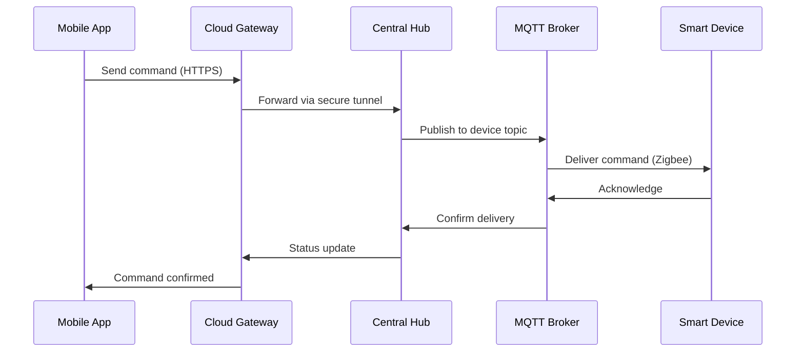
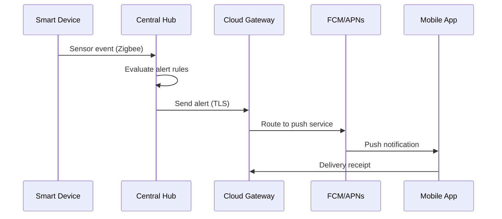

# Communication Architecture

## Overview

The communication architecture defines how smart devices communicate with the
central hub and how alerts are delivered to users.

## Components

### Local Communication Layer

- MQTT broker running on central hub
- Zigbee mesh network for device-to-hub communication
- Local processing for sub-500ms command latency

### Cloud Communication Layer

- Secure TLS connection to cloud gateway
- Push notification routing via FCM/APNs
- Fallback SMS gateway for critical alerts

## Data Flow - Command Path

## Data Flow - Alert Path

