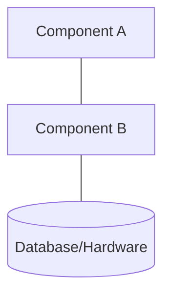
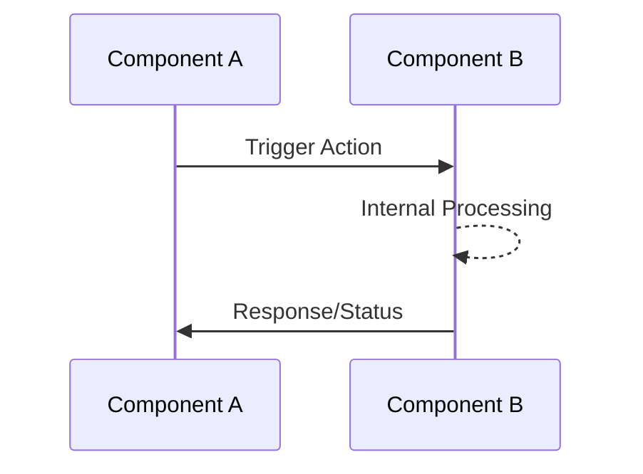
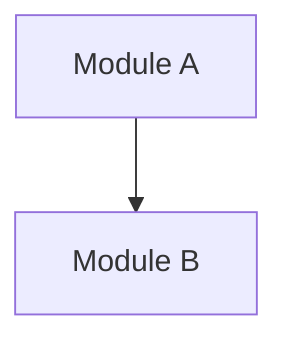
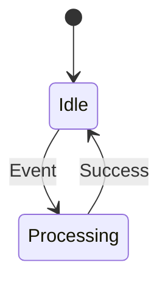

# Feature Specification: Requirements Knowledge Graph CLI

**Feature Branch**: `001-requirements-knowledge-graph`
**Created**: 2026-01-11
**Status**: Draft
**Input**: User description: "Build a command-line application that manages Architecture documents and Requirements as a unified interconnected knowledge graph. By parsing Markdown files and their metadata stored across multiple Git repositories, the tool ensures that every technical definition and design choice is linked, version-controlled, and verifiable."

## User Scenarios & Testing *(mandatory)*

### User Story 1 - Validate Documentation Integrity (Priority: P1)

As a systems engineer, I want to validate that all my architecture and requirements documents are properly linked and complete, so that I can identify broken references and missing traceability before they cause downstream issues.

**Why this priority**: This is the core value proposition - engineers need confidence that their documentation graph is consistent and complete. Without integrity validation, the entire system loses its purpose as a "Single Source of Truth."

**Independent Test**: Can be fully tested by running a validation command against a set of Markdown documents and verifying it reports broken links, orphaned items, and missing required relationships.

**Acceptance Scenarios**:

1. **Given** a repository with interconnected Markdown documents, **When** I run the validation command, **Then** the CLI reports all broken links between documents with specific file locations and line numbers.
2. **Given** a System Requirement without a parent Scenario, **When** validation runs, **Then** the CLI identifies it as an orphaned item requiring attention.
3. **Given** a Scenario without any realizing System Architecture, **When** validation runs, **Then** the CLI reports the incomplete traceability chain.
4. **Given** all documents are properly linked, **When** validation runs, **Then** the CLI confirms the graph integrity with a success status.

---

### User Story 2 - Parse Multi-Repository Document Graph (Priority: P1)

As a technical lead managing documentation across multiple Git repositories, I want the CLI to parse and aggregate Markdown files from all configured repositories, so that I can maintain a unified view of the complete engineering lifecycle.

**Why this priority**: Multi-repository support is essential for real-world enterprise systems where hardware, software, and system-level documentation live in separate repositories maintained by different teams.

**Independent Test**: Can be fully tested by configuring multiple repository paths and verifying the CLI successfully parses and correlates documents across repository boundaries.

**Acceptance Scenarios**:

1. **Given** a configuration file specifying multiple Git repository paths, **When** I run the parse command, **Then** the CLI scans all repositories and builds a unified knowledge graph.
2. **Given** a document in repository A references a document in repository B, **When** parsing completes, **Then** the CLI correctly resolves the cross-repository link.
3. **Given** a repository path that doesn't exist or isn't accessible, **When** I run the parse command, **Then** the CLI reports a clear error indicating which repository failed and why.

---

### User Story 3 - Query Traceability Chains (Priority: P2)

As a verification engineer, I want to query the complete traceability chain from a Solution down to Detailed Designs (or any subset), so that I can verify that customer requirements are fully decomposed into implementable specifications.

**Why this priority**: Traceability queries enable engineers to understand impact analysis and verify completeness. This builds on the parsed graph from P1 stories.

**Independent Test**: Can be fully tested by querying a known document and verifying the CLI returns its complete upstream and downstream relationships.

**Acceptance Scenarios**:

1. **Given** a parsed knowledge graph, **When** I query a specific Use Case by its identifier, **Then** the CLI displays all Scenarios that realize it and all System Requirements those Scenarios require.
2. **Given** a Software Requirement, **When** I query its upstream chain, **Then** the CLI traces back through System Architecture, System Requirements, Scenario, Use Case, to the parent Solution.
3. **Given** a Solution identifier, **When** I query its downstream chain, **Then** the CLI displays the complete decomposition tree to all leaf-level Detailed Designs.
4. **Given** a query for a non-existent identifier, **When** the query runs, **Then** the CLI reports "Item not found" with suggestions for similar identifiers.

---

### User Story 4 - Generate Traceability Reports (Priority: P2)

As a project manager, I want to generate coverage and traceability reports in exportable formats, so that I can share documentation status with stakeholders who don't use the CLI.

**Why this priority**: Reports enable communication with non-technical stakeholders and create audit artifacts. This extends the query capabilities into shareable outputs.

**Independent Test**: Can be fully tested by running a report command and verifying it produces correctly formatted output containing the expected traceability information.

**Acceptance Scenarios**:

1. **Given** a parsed knowledge graph, **When** I request a coverage report, **Then** the CLI generates a summary showing the percentage of items at each level that have complete traceability chains.
2. **Given** a valid graph, **When** I export a traceability matrix, **Then** the output shows relationships between all item types in a structured format.
3. **Given** a report request, **When** I specify an output format, **Then** the CLI generates the report in that format (human-readable text by default).

---

### User Story 5 - Manage Document Metadata (Priority: P3)

As a documentation author, I want the CLI to help me add and validate metadata in my Markdown files, so that my documents are properly identifiable and linkable within the knowledge graph.

**Why this priority**: Metadata management helps authors create compliant documents but is less critical than consuming and validating existing documentation.

**Independent Test**: Can be fully tested by running metadata commands against a Markdown file and verifying the metadata is correctly added or validated.

**Acceptance Scenarios**:

1. **Given** a Markdown file without metadata, **When** I run the initialize command for a specific item type, **Then** the CLI adds the required metadata header with appropriate fields for that type.
2. **Given** a document with existing metadata, **When** I run the validate-metadata command, **Then** the CLI verifies all required fields are present and correctly formatted.
3. **Given** a document with invalid metadata format, **When** validation runs, **Then** the CLI reports specific errors about which fields are missing or malformed.
4. **Given** the init command is run with only a file name (or no arguments), **When** the command executes, **Then** the CLI enters interactive mode and guides the user through each required field using prompts, select lists, and text inputs.
5. **Given** the user is in interactive mode, **When** prompted for item type, **Then** the CLI presents a select list of all valid item types (Solution, Use Case, Scenario, etc.) for the user to choose from.
6. **Given** the user is in interactive mode, **When** prompted for traceability links (refines, derives_from, satisfies), **Then** the CLI presents available items from the parsed graph as selectable options (multi-select where appropriate).
7. **Given** the user is in interactive mode and provides invalid input, **When** validation fails, **Then** the CLI displays a clear error message and re-prompts for the same field.
8. **Given** the user is in interactive mode, **When** all required fields are collected, **Then** the CLI generates the document with the provided metadata and displays a summary of what was created.

---

### User Story 6 - Track Changes Across Versions (Priority: P3)

As a configuration manager, I want to compare the knowledge graph between Git commits or branches, so that I can understand how the documentation structure has evolved and identify when traceability was broken.

**Why this priority**: Version comparison is an advanced feature that extends the core functionality. Teams can use Git directly for basic version control initially.

**Independent Test**: Can be fully tested by comparing the graph between two known commits and verifying the CLI correctly identifies added, removed, and modified relationships.

**Acceptance Scenarios**:

1. **Given** two Git commit references, **When** I run the diff command, **Then** the CLI shows which items and links were added, removed, or modified between versions.
2. **Given** a commit where a link was broken, **When** comparing to the previous commit, **Then** the CLI highlights the broken relationship.

---

### User Story 7 - Edit Existing Document Metadata (Priority: P3)

As a documentation author, I want the CLI to help me edit the metadata of an existing item by its identifier, so that I can update traceability links, descriptions, or other fields without manually editing YAML frontmatter.

**Why this priority**: Editing existing items is a natural extension of the init command. Authors need to maintain documents over time, updating links as the system evolves.

**Independent Test**: Can be fully tested by running the edit command with an item ID and verifying the metadata is correctly updated in the corresponding Markdown file.

**Acceptance Scenarios**:

1. **Given** an existing item with identifier "SREQ-001", **When** I run `sara edit SREQ-001`, **Then** the CLI enters interactive mode and pre-populates all prompts with the current values from the document.
2. **Given** an existing item, **When** I run `sara edit <ID> --name "New Name"`, **Then** the CLI updates only the name field without prompting for other fields.
3. **Given** an existing item in interactive mode, **When** I navigate through prompts, **Then** each prompt shows the current value as the default and allows me to keep it by pressing Enter or modify it.
4. **Given** an existing item, **When** I run `sara edit <ID> --derives-from SCEN-002`, **Then** the CLI updates the traceability links while preserving all other metadata.
5. **Given** an item ID that doesn't exist in the graph, **When** I run the edit command, **Then** the CLI reports "Item not found" with suggestions for similar identifiers.
6. **Given** the user is in interactive edit mode and presses Ctrl+C, **When** the interrupt is received, **Then** no changes are saved and the original file remains unchanged.

---

### Edge Cases

- What happens when circular references exist between documents (e.g., Document A references B, B references A)?
- How does the system handle documents with duplicate identifiers across repositories?
- What happens when a referenced document exists but is in an uncommitted state?
- How does the system handle Markdown files that don't conform to the expected metadata format?
- What happens when the same item type has conflicting definitions across repositories?
- How does the system handle very large repositories with thousands of documents?
- What happens when interactive mode is used but the terminal doesn't support interactive input (e.g., piped input, non-TTY environment)? → **Resolved**: Exit with error message instructing user to provide CLI arguments (FR-051).
- How does interactive mode handle traceability prompts when no existing items of the required type exist in the graph? → **Resolved**: Block creation until parent items exist; display error listing required parent types (FR-052).
- What happens if the user's terminal window is too narrow to display the select list properly? → **Resolved**: Rely on standard terminal behavior (text wrapping); no special handling required as interactive prompts adapt to terminal width automatically.

## Requirements *(mandatory)*

### Functional Requirements

**Core Parsing & Graph Construction**

- **FR-001**: System MUST parse Markdown files and extract metadata from YAML frontmatter or a defined header format.
- **FR-002**: System MUST build an in-memory graph representation of all parsed items and their relationships.
- **FR-003**: System MUST support the following item types: Solution, Use Case, Scenario, System Requirement, System Architecture, Hardware Requirement, Software Requirement, Hardware Detailed Design, Software Detailed Design.
- **FR-004**: System MUST resolve references between items using unique identifiers embedded in document metadata.
- **FR-005**: System MUST support configuring multiple Git repository paths as sources.

**Relationship Model**

- **FR-006**: System MUST enforce that Solution is refined by Use Cases.
- **FR-007**: System MUST enforce that Use Case is refined by Scenarios.
- **FR-008**: System MUST enforce that Scenario derives System Requirements.
- **FR-009**: System MUST enforce that System Requirements are satisfied by System Architecture.
- **FR-010**: System MUST enforce that System Architecture derives Hardware Requirements and/or Software Requirements.
- **FR-011**: System MUST enforce that Hardware Requirements are satisfied by Hardware Detailed Designs.
- **FR-012**: System MUST enforce that Software Requirements are satisfied by Software Detailed Designs.
- **FR-013**: System MUST support bidirectional relationship traversal with the following relationship types:
  - `refines` / `is_refined_by` - refinement relationship (e.g., Scenario refines Use Case)
  - `derives` / `derives_from` - derivation relationship (e.g., System Requirement derives from Scenario)
  - `satisfies` / `is_satisfied_by` - satisfaction relationship (e.g., System Architecture satisfies System Requirement)
  - `depends_on` / `is_required_by` - dependency relationship between requirements (e.g., SREQ-002 depends on SREQ-001)

**Validation & Integrity**

- **FR-014**: System MUST detect and report broken references (links to non-existent items).
- **FR-015**: System MUST detect and report orphaned items (items with no upstream parent when one is required); orphan handling MUST be configurable between strict mode (errors that block operations) and permissive mode (warnings only).
- **FR-016**: System MUST detect and report duplicate identifiers across the document set; validation MUST fail with an error when duplicates are found (duplicates block all operations).
- **FR-017**: System MUST detect and report circular references as validation errors (cycles indicate modeling mistakes and block operations).
- **FR-018**: System MUST validate that required metadata fields are present for each item type (including `specification` for System Requirements, Hardware Requirements, and Software Requirements); files with malformed or missing metadata MUST cause validation to fail.
- **FR-019**: System MUST produce a warning when unrecognized custom fields are found in YAML frontmatter, unless those fields are declared as allowed custom fields in the configuration file.
- **FR-067**: System MUST produce a warning when both items in a relationship explicitly declare the link (e.g., SARCH-001 has `satisfies: [SYSREQ-001]` and SYSREQ-001 has `is_satisfied_by: [SARCH-001]`); only one declaration is needed since the inverse is automatically inferred.

**Querying & Traversal**

- **FR-020**: System MUST support querying an item by its unique identifier.
- **FR-021**: System MUST support traversing upstream (toward Solution) from any item.
- **FR-022**: System MUST support traversing downstream (toward Detailed Designs) from any item.
- **FR-023**: System MUST support filtering query results by item type.

**Reporting**

- **FR-024**: System MUST generate coverage reports showing percentage of items with complete traceability.
- **FR-025**: System MUST generate traceability matrices showing item relationships.
- **FR-026**: System MUST support human-readable text output format for all reports.

**CLI Interface**

- **FR-027**: System MUST provide a command-line interface with clear subcommands for each major function (parse, validate, query, report).
- **FR-028**: System MUST provide helpful error messages that include file paths and line numbers where applicable.
- **FR-029**: System MUST support a configuration file for repository paths and other settings.
- **FR-030**: System MUST return appropriate exit codes (0 for success, non-zero for errors/validation failures).
- **FR-031**: System MUST support configurable logging levels (e.g., quiet, normal, verbose, debug).
- **FR-032**: System MUST display output with colors and emojis to improve readability (errors, warnings, success indicators).
- **FR-053**: System MUST organize CLI help output into logical groups using help headings (e.g., "Item Properties", "Traceability", "Global Options") to improve readability and discoverability of related options.

**Version Control Integration**

- **FR-033**: System MUST read from the working directory by default (including uncommitted changes).
- **FR-034**: System MUST support an optional flag to read documents from a specific Git commit or branch instead of the working directory.
- **FR-035**: System MUST support comparing graphs between two Git references.

**Platform Support**

- **FR-036**: System MUST run on Windows, macOS, and Linux operating systems.

**Document Templates**

- **FR-037**: System MUST provide Markdown document templates for each item type (Solution, Use Case, Scenario, System Requirement, System Architecture, Hardware Requirement, Software Requirement, Hardware Detailed Design, Software Detailed Design).
- **FR-038**: System MUST support an `init` command that generates a new document from the appropriate template for a specified item type.
- **FR-039**: System MUST support user-provided custom templates by specifying one or more paths (including glob patterns such as `*.md`) in the configuration file; each custom template MUST contain exactly one `type` field in its YAML frontmatter to identify the item type it defines; custom templates override built-in templates for the corresponding item type.

**Interactive Mode**

- **FR-040**: System MUST enter interactive mode when the `init` command is invoked with only a file name or no arguments (i.e., when the required `--type` argument is not provided).
- **FR-041**: System MUST present an interactive select list for choosing the item type, displaying all valid item types with human-readable labels.
- **FR-042**: System MUST prompt for the item name using a text input with validation (non-empty, reasonable length).
- **FR-043**: System MUST prompt for the item description using a text input (optional field).
- **FR-044**: System MUST prompt for a unique identifier with a suggested default based on item type and existing items (e.g., "SOL-003" if SOL-001 and SOL-002 exist).
- **FR-045**: System MUST prompt for traceability relationships appropriate to the item type using multi-select lists populated with existing items from the knowledge graph (e.g., for a Scenario, show available Use Cases for the "refines" field).
- **FR-046**: System MUST prompt for type-specific fields when applicable (e.g., "specification" for requirement types, "platform" for System Architecture).
- **FR-047**: System MUST validate each input as it is provided and display clear error messages for invalid input, re-prompting for the same field until valid input is received.
- **FR-048**: System MUST display a summary of all collected information before generating the document and allow the user to confirm or cancel.
- **FR-049**: System MUST support Ctrl+C (interrupt) to cancel interactive mode at any point without creating any files.
- **FR-050**: System MUST skip interactive prompts for fields that are already provided via command-line arguments (allowing partial interactive mode).
- **FR-051**: System MUST detect non-TTY environments (piped input, CI/CD, scripted execution) and exit with a clear error message instructing the user to provide required arguments via command-line flags instead of interactive prompts.
- **FR-052**: System MUST block document creation in interactive mode when required parent items do not exist (e.g., cannot create a Scenario without at least one Use Case existing); the CLI MUST display a clear error listing which parent item types must be created first.

**Edit Command**

- **FR-054**: System MUST provide an `edit` command that accepts an item identifier as its primary argument and locates the corresponding document in the knowledge graph.
- **FR-055**: System MUST enter interactive edit mode when the `edit` command is invoked with only an item identifier (no other modification flags provided).
- **FR-056**: System MUST pre-populate all interactive prompts with the current values from the existing document, allowing the user to keep current values by pressing Enter or modify them.
- **FR-057**: System MUST support the same field modification options as the `init` command (`--name`, `--description`, `--refines`, `--derives-from`, `--satisfies`, `--specification`, `--platform`) for non-interactive editing.
- **FR-058**: System MUST update only the specified fields when modification flags are provided, preserving all other existing metadata unchanged.
- **FR-059**: System MUST NOT allow changing the item type via the edit command (type is immutable after creation).
- **FR-060**: System MUST NOT allow changing the item identifier via the edit command (ID is immutable after creation).
- **FR-061**: System MUST report "Item not found" with suggestions for similar identifiers when the provided ID does not exist in the knowledge graph.
- **FR-062**: System MUST preserve the original file unchanged if the user cancels (Ctrl+C) during interactive edit mode.
- **FR-063**: System MUST display a summary of changes before applying them and allow the user to confirm or cancel in interactive edit mode.
- **FR-064**: System MUST preserve all non-metadata content (body text, sections) of the Markdown file when updating metadata.
- **FR-065**: System MUST validate that new traceability links reference existing items before applying changes.
- **FR-066**: System MUST detect non-TTY environments for the edit command and exit with a clear error message when interactive mode is required but unavailable.

### Key Entities

- **Solution**: Represents a customer-facing solution. Contains unique identifier, name, description. Is refined by Use Cases.
- **Use Case**: Captures customer or market needs. Contains unique identifier, name, description. Refines a Solution and is refined by Scenarios.
- **Scenario**: Describes abstract system behavior. Contains unique identifier, name, description. Refines a Use Case and derives System Requirements.
- **System Requirement**: Defines quantifiable system-level needs (functional or non-functional). Contains unique identifier, name, description, specification (mandatory requirement statement), optional `depends_on`/`is_required_by` links to other System Requirements. Derives from a Scenario and is satisfied by System Architectures.
- **System Architecture**: Implements System Requirements on a specific platform. Contains unique identifier, name, description, platform, and `justified_by` (reserved for future ADR links). Satisfies System Requirements and derives Hardware/Software Requirements.
- **Hardware Requirement**: Details hardware-specific needs. Contains unique identifier, name, description, specification (mandatory requirement statement), optional `depends_on`/`is_required_by` links to other Hardware Requirements. Derives from a System Architecture and is satisfied by Hardware Detailed Designs.
- **Software Requirement**: Details software-specific needs. Contains unique identifier, name, description, specification (mandatory requirement statement), optional `depends_on`/`is_required_by` links to other Software Requirements. Derives from a System Architecture and is satisfied by Software Detailed Designs.
- **Hardware Detailed Design**: Describes hardware-level technical implementation. Contains unique identifier, name, description. Satisfies a Hardware Requirement.
- **Software Detailed Design**: Describes software-level technical implementation. Contains unique identifier, name, description. Satisfies a Software Requirement.
- **Relationship**: Represents a typed bidirectional link between two items. Contains source item, target item, and relationship type (refines/is_refined_by, derives/derives_from, satisfies/is_satisfied_by, depends_on/is_required_by).

### Document Templates

#### Solution Template

```markdown
---
id: "SOL-XXX"
type: solution
name: "Solution Name"
description: "Brief description of the solution"
is_refined_by: [] # List of Use Case IDs
---

# Solution: {{name}}

## Overview
[High-level description of the customer-facing solution]

## Business Context
[Market need, customer problem, or business opportunity this solution addresses]

## Goals & KPIs
- **Goal**: [Description of the objective]
    - *KPI*: [Measurable indicator to track the success of this goal]

## Stakeholders
- [Stakeholder Name/Role]: [Description of their interest or impact on the solution]

## Constraints
- **Regulatory**: [Mandatory standards or legal compliance requirements]
- **Physical & Design Context**: [Physical limits, pre-selected hardware, or environmental boundaries]
- **Operational**: [Integration needs with existing systems or operational environment]
- **Safety & Security**: [Critical safety behaviors or data protection constraints]
- **Business**: [Cost, time-to-market, or commercial boundaries]
```

#### Use Case Template

```markdown
---
id: "UC-XXX"
type: use_case
name: "Use Case Name"
description: "Brief description of the use case"

# Traceability
refines: [] # List of Solution IDs
is_refined_by: [] # List of Scenario IDs
---

# Use Case: {{name}}

## Actor(s)
- **Primary Actor**: [Who initiates or benefits from this use case]
- **Secondary Actors**: [Other participants or external systems involved]

## Pre-conditions
- [Condition that must be true before the use case can start]

## Main Success Outcome
[High-level description of the successful value delivered to the actor]

## Key Functional Scope
- [Function]: [High-level capability or feature required to fulfill this use case]

## Post-conditions
- [Success Condition]: [The state of the system after successful completion]
- [Failure Condition]: [The state of the system if the use case fails or is interrupted]
```

#### Scenario Template

```markdown
---
id: "SCEN-XXX"
type: scenario
name: "Scenario Name"
description: "Brief description of the specific path through the Use Case"

# Traceability
refines: [] # List of Use Case IDs
derives: [] # List of System Requirement IDs
---

# Scenario: {{name}}

## Overview
[Briefly explain the goal of this specific path and the intent of the interaction.]

## Initial State
[Describe the specific conditions required: e.g., System Mode, User Permissions, or Hardware status.]

## Trigger
[The specific event—user action, timer, or system signal—that starts this sequence.]

## Step-by-Step Flow
1. [Action]: [Who does what, e.g., User provides input X]
2. [Reaction]: [How the system responds, e.g., System validates X and displays Y]
3. [Action]: [Next logical step in the sequence]

## Expected Outcome
- [Success Condition]: [The final state of the system and the specific output provided.]
- [Verification]: [How an observer or test tool can confirm the scenario ended correctly.]

## Exceptions & Edge Cases
- [Exception Path]: [What happens if a step fails or a specific constraint is violated during this flow.]
```

#### System Requirement Template

```markdown
---
id: "SYSREQ-XXX"
type: system_requirement
name: "Requirement Name"
description: "One-sentence summary"
specification: "The system SHALL [action] [under conditions]."

# Traceability
derives_from: []    # List of Scenario IDs
is_satisfied_by: [] # List of System Architecture IDs
dependencies: []    # List of other System Requirement IDs this requirement depends on
---

# System Requirement: {{name}}

## Requirement Specification
> {{specification}}

## Rationale
[Explain why this requirement is necessary and the value it provides to the system.]

## Acceptance Criteria
- [Measurable criterion 1]
- [Measurable criterion 2]

## Verification Plan
- **Method**: [test, analysis, inspection, demonstration]
- **Procedure**: [Briefly describe how the verification will be conducted.]

## Notes
[Additional context or technical clarifications.]
```

#### System Architecture Template

````markdown
---
id: "SYSARCH-XXX"
type: system_architecture
name: "Architecture Name"
description: "Brief summary of the architectural approach"
platform: "Target platform (e.g., STM32, AWS, Linux)"

# Traceability
satisfies: [] # List of System Requirement IDs
derives: []   # List of Software/Hardware Requirement IDs
justified_by: [] # Future links to Architecture Decision Records
---

# Architecture: {{name}}

## Technical Strategy

[One or two sentences explaining how this architecture satisfies the requirements on the {{platform}} platform.]

## Static View (Structure)

[Description of the physical or logical partitioning of the system.]



## Dynamic View (Behavior)

[Sequence of interactions between components to fulfill a specific function.]


````

#### Hardware Requirement Template

```markdown
---
id: "HWREQ-XXX"
type: hardware_requirement
name: "Requirement Name"
description: "One-sentence summary"
specification: "The hardware SHALL [action] [under conditions]."

# Traceability
derives_from: []    # List of System Architecture IDs
is_satisfied_by: [] # List of Hardware Detailed Design IDs
dependencies: []    # List of other Hardware Requirement IDs this requirement depends on
---

# Hardware Requirement: {{name}}

## Requirement Specification
> {{specification}}

## Rationale
[Explain why this requirement is necessary and the value it provides to the system.]

## Technical Specifications
[Free text or table: Define parameters like voltage, current, tolerances, dimensions, or environmental constraints.]

## Acceptance Criteria
- [Measurable criterion 1]
- [Measurable criterion 2]

## Verification Plan
- **Method**: [test, analysis, inspection, demonstration]
- **Procedure**: [Briefly describe how the verification will be conducted.]

## Notes
[Additional context or technical clarifications.]
```

#### Software Requirement Template

```markdown
---
id: "SWREQ-XXX"
type: software_requirement
name: "Requirement Name"
description: "One-sentence summary"
specification: "The software SHALL [action] [under conditions]."

# Traceability
derives_from: []    # List of System Architecture IDs
is_satisfied_by: [] # List of Software Detailed Design IDs
dependencies: []    # List of other Software Requirement IDs this requirement depends on
---

# Software Requirement: {{name}}

## Requirement Specification
> {{specification}}

## Rationale
[Explain why this requirement is necessary and the value it provides to the system.]

## Logic & Interface Details
[Free text, table, or pseudocode: Define algorithms, inputs/outputs, error handling, or state transitions.]

## Acceptance Criteria
- [Measurable criterion 1, e.g., Execution time < 50ms]
- [Measurable criterion 2, e.g., Handles null pointer gracefully]

## Verification Plan
- **Method**: [test, analysis, inspection, demonstration]
- **Procedure**: [Briefly describe how the verification will be conducted (e.g., Unit Test, Static Analysis).]

## Notes
[Additional context or technical clarifications.]
```

#### Hardware Detailed Design Template

```markdown
---
id: "HWARCH-XXX"
type: hardware_detailed_design
name: "Design Name"
description: "Brief summary of the physical implementation"

# Traceability
satisfies: [] # List of Hardware Requirement IDs
---

# Hardware Design: {{name}}

## Overview
[Detailed description of how this hardware design implements the required functionality.]

## Bill of Materials (BOM)
- **[Part Number]**: [Description], [Quantity], [Manufacturer]
- **[Part Number]**: [Description], [Quantity], [Manufacturer]

## Schematic & Layout References
- **Schematic**: [Reference or link to the schematic document]
- **PCB Layout**: [Reference or link to the layout document]

## Test Points
- **[TP ID]**: [Signal Name], [Expected Value/Waveform]
- **[TP ID]**: [Signal Name], [Expected Value/Waveform]

## Design Calculations & Simulations
[Key calculations: e.g., Power consumption, thermal dissipation, or component sizing.]

## Assembly & Manufacturing
[Specific instructions: e.g., Mounting torque, thermal interface material, or specific soldering standards.]

## Notes
[Additional technical clarifications or constraints.]
```

#### Software Detailed Design Template

````markdown
---
id: "SWARCH-XXX"
type: software_detailed_design
name: "Implementation Name"
description: "Detailed logic and structure of the software module"

# Traceability
satisfies: [] # List of Software Requirement IDs
---

# Software Implementation: {{name}}

## Overview
[Description of the technical approach and how this module fulfills its requirements.]

## Static View (Structure)
[Description of the code structure: modules, crates, or classes. Diagram optional.]



## Dynamic View (Logic)
[Description of the internal behavior, algorithms, or state transitions.]



## Interface & API Definitions
[Link to API documentation (e.g., Rustdoc, Swagger) or brief description of key functions/methods.]

## Error Handling & Edge Cases
[Description of how the implementation detects and recovers from failures.]

## Notes
[Additional technical context, technical debt, or integration specificities.]
````

## Success Criteria *(mandatory)*

### Measurable Outcomes

- **SC-001**: Engineers can validate a 500-document repository and receive complete integrity results within 1 seconds.
- **SC-002**: 100% of broken links in a document set are detected and reported with actionable location information.
- **SC-003**: Engineers can trace any item to its complete upstream and downstream chain in a single command.
- **SC-004**: Cross-repository references are resolved correctly when documents span up to 10 separate repositories.
- **SC-005**: Validation errors identify the specific file, line number, and nature of the problem in 95% of cases.
- **SC-006**: New team members can run their first validation within 5 minutes of installation using provided documentation.
- **SC-007**: Coverage reports accurately reflect the actual traceability completeness within the document set.
- **SC-008**: Engineers report at least 50% reduction in time spent manually checking documentation consistency.

## Clarifications

### Session 2026-01-14

- Q: How should the CLI behave when interactive mode cannot function (non-TTY environment)? → A: Detect non-TTY and exit with error message instructing user to provide required arguments.
- Q: How should interactive mode handle traceability prompts when no parent items exist? → A: Block creation until parent items exist (strict hierarchical enforcement).

### Session 2026-01-11

- Q: How should the system handle duplicate identifiers across repositories? → A: Fail validation entirely - duplicates are errors that block all operations.
- Q: Are circular references valid or always an error? → A: Always an error - circular references indicate modeling mistakes.
- Q: How should the system handle Markdown files with malformed or missing metadata? → A: Fail entirely - all documents must have valid metadata.
- Q: Should the CLI read uncommitted files or only committed Git state? → A: Working directory by default; optional flag to check specific Git commit/branch.
- Q: Must every item have complete upstream traceability to Solution? → A: Configurable - strict mode (orphans are errors) vs. permissive mode (orphans are warnings).
- Q: Should logging verbosity be configurable? → A: Yes - logging level must be configurable.
- Q: Which platforms must the application support? → A: Windows, macOS, and Linux.
- Q: Should CLI output use colors? → A: Yes - output results with colors and emojis.

## Assumptions

- Markdown files use YAML frontmatter for metadata (standard practice in documentation-as-code workflows).
- Item identifiers follow a consistent naming convention within each organization (e.g., "SOL-001", "UC-001", "SREQ-001").
- Git repositories are accessible from the machine running the CLI (either locally cloned or via configured credentials).
- Users have basic familiarity with command-line tools and Git workflows.
- The document structure within repositories follows a predictable pattern that can be configured (e.g., specific directories for each item type, or all items in a single directory with type indicated by metadata).
