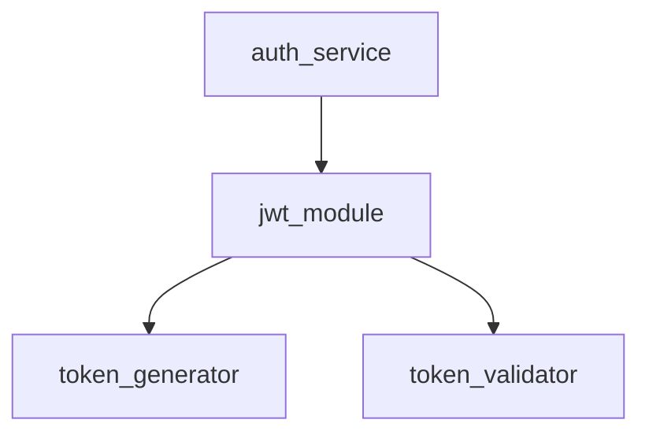
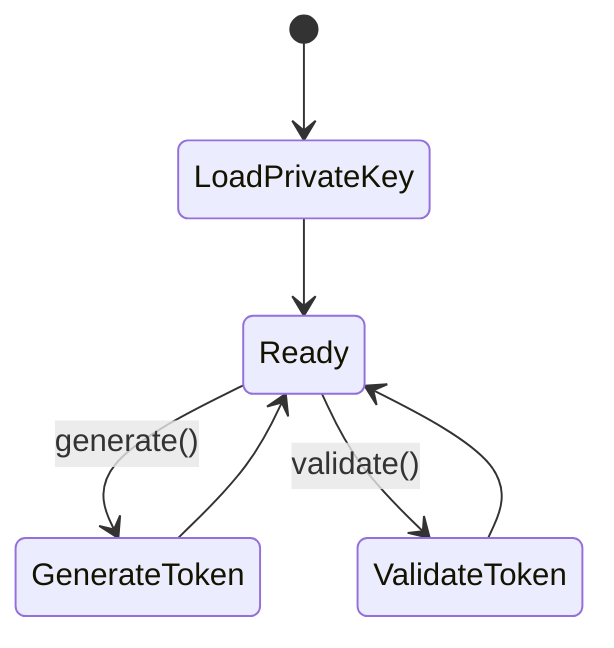

# Software Implementation: Auth Service JWT Module

## Overview

Rust module implementing JWT token generation using the `jsonwebtoken` crate.

## Static View (Structure)



## Dynamic View (Logic)



## Interface & API Definitions

```rust
pub fn generate_token(user_id: &str) -> Result<String, AuthError>;
pub fn validate_token(token: &str) -> Result<Claims, AuthError>;
```

## Error Handling & Edge Cases

- Invalid private key: Return ConfigError
- Expired token: Return TokenExpired error
- Invalid signature: Return InvalidToken error

## Notes

Uses `jsonwebtoken` crate version 9.x for RS256 support.
