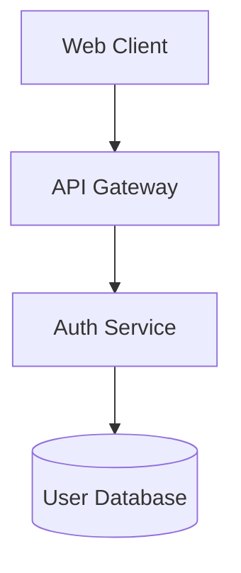
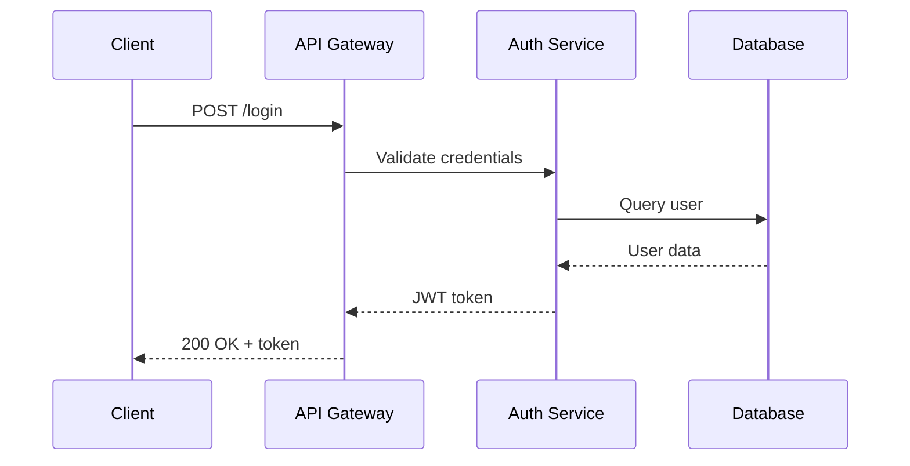

# Architecture: Web Authentication Architecture

## Technical Strategy

JWT-based stateless authentication on AWS Cloud platform to meet the 2-second response time requirement.

## Static View (Structure)

## Dynamic View (Behavior)

